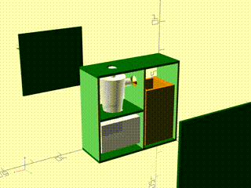

# Tiny Dust Collector

Using a shopvac for sawdust and woodchips makes a mess when you go to empty it or (God forbid) unclog the filter.

Big wood shops can use a proper dust collector even if it takes up a lot of space.

But what if you don't have a lot of space?

Oneida Air Systems makes a product called the [Dust Deputy](https://www.oneida-air.com/dust-deputy) that you can bolt onto a five-gallon bucket and a shop vac. It will slow down the bigger dust particles by spinning them around in a funnel, like would happen inside a normal dust collector, and keep most of the dust out of the shopvac.

But what if you don't have a lot of space for a five gallon bucket and a big round shop vac?

Smaller shopvacs like the [RIDGID 3 Gallon 5.0 Peak HP NXT](https://www.homedepot.com/p/RIDGID-3-Gallon-5-0-Peak-HP-NXT-Shop-Vac-Wet-Dry-Vacuum-with-Fine-Dust-Filter-Expandable-Hose-and-Accessory-Attachments-HD0300/320181466) are about the size of a toolbox. They'll work in an upright position if you find the valve that closes when they're picking up liquid and hold it open with a rubber band.

Instead of the 5-gallon bucket, you can bolt the Oneida Air Systems Dust Deputy onto a firmly sealing plastic box.

## An Enclosure

Here's my design for a plywood enclosure that holds these three things together so that they don't pull apart and tip over during use. It also helps a bit keeping the noise of the shopvac down.

The .scad file can be opened with [OpenSCAD](https://openscad.org). Units are in inches.

It's 29 inches tall, 32 inches wide, and 13-1/2 inches deep. Joinery is left as an exercise for the reader (I went with dowels).

I also wound up installing the front panel on [frameless, full overlap](https://www.rockler.com/blumreg-110deg-soft-close-blumotion-clip-top-overlay-hinges-for-frameless-cabinets-hinges) hinges and drilling a bunch of holes in the back for shopvac exhaust.
